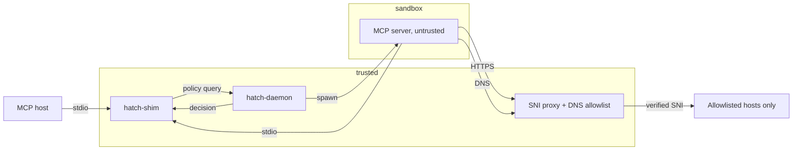

<div align="center">


</div>

Capability-based isolation for AI tool servers.

`hatch` sandboxes MCP (Model Context Protocol) servers on Linux and macOS,
enforcing per-server network, filesystem, and protocol-level policies declared
in signed manifests.

The threat model is in [`docs/src/concepts/threat-model.md`](docs/src/concepts/threat-model.md).

## Architecture



Sandbox enforcement on Linux: user/mount/pid/net namespaces, cgroups v2, and
iptables redirects inside a per-server netns. On macOS: `sandbox-exec`
profile, PF anchor per sandbox UID, and a UID pool.

Every tool call from the host passes through the shim, which queries the
daemon's compiled policy (deny lists, glob patterns, CEL rules over arguments,
response-redaction filters). Every network connection from the sandboxed
server is forced through the SNI proxy and DNS resolver, both of which only
permit destinations declared in the server's signed manifest. Everything is
audited to JSONL with a hash chain.

## Build

```bash
cargo build --workspace
cargo test --workspace
```

Requirements: Rust stable (1.83+). 

- On Linux: a kernel with user namespaces, cgroups v2, seccomp, and Landlock (5.13+).
- On macOS: 13 or newer.

> Note: there is no windows support yet

## Run

Smoke-test the full pipeline with no external dependencies. `minimal.toml`
runs `/bin/cat` under the daemon, exercises stdio routing, audit logging,
and the IPC protocol end to end:

```bash
cargo run -p hatch-daemon -- --foreground --state-dir ./.hatch &
cargo run -p hatch-cli   -- --state-dir ./.hatch status
cargo run -p hatch-cli   -- manifest validate examples/manifests/minimal.toml
cargo run -p hatch-cli   -- --state-dir ./.hatch install --file examples/manifests/minimal.toml --allow-unsigned
cargo run -p hatch-cli   -- --state-dir ./.hatch run minimal --seconds 2
cargo run -p hatch-cli   -- --state-dir ./.hatch audit
cargo run -p hatch-cli   -- --state-dir ./.hatch daemon stop
```

For a real MCP server, install `examples/manifests/filesystem.toml`. It
wraps the official `@modelcontextprotocol/server-filesystem` scoped to
`$PROJECT_ROOT`. Requires Node:

```bash
cargo run -p hatch-cli -- --state-dir ./.hatch \
    install --file examples/manifests/filesystem.toml --allow-unsigned
cargo run -p hatch-cli -- --state-dir ./.hatch run filesystem --seconds 5
```

Daemon flags worth knowing:

- `--enable-proxy` — start the SNI proxy and DNS allowlist resolver.
- `--real-sandbox` — use the Linux or macOS backend instead of the passthrough stub.
- `--metrics-addr 127.0.0.1:9876` — expose Prometheus metrics.

## CLI

```
hatch status                  daemon health
hatch list [--running]        installed manifests / running servers
hatch ps                      running servers
hatch run NAME                spawn an installed manifest
hatch stop TARGET             stop a running server
hatch inspect TARGET          show a running server's compiled policy
hatch install --file PATH     install a local manifest
hatch uninstall NAME
hatch approve ID [--remember once|session|manifest-version]
hatch deny ID
hatch audit [--tui]           tail / interactive audit viewer
hatch observe -- CMD ...      run with syscall tracing, emit candidate manifest
hatch manifest validate PATH
hatch manifest explain PATH
hatch manifest show NAME
hatch manifest diff NAME PATH
hatch config status
hatch config sync [--host H] [--force]
hatch config unsync [--host H]
hatch registry install-bundle PATH
hatch registry list
hatch registry verify NAME
hatch daemon status | stop
hatch doctor
hatch version
```

`--format json` switches structured output. Exit codes: 0 success, 11 not
found, 12 manifest invalid, 13 signature failed, 14 approval timeout, 15
spawn failed.

## Manifest

```toml
schema_version = "1.0"
name = "github"
version = "1.2.0"
description = "Official GitHub MCP server"

[command]
program = "npx"
args = ["-y", "@modelcontextprotocol/server-github"]

[network]
allow_https = ["api.github.com", "*.githubusercontent.com"]
allow_dns   = ["api.github.com", "*.githubusercontent.com"]

[filesystem]
read  = []
write = []
tmpfs = ["/tmp"]

[env]
passthrough = ["GITHUB_TOKEN"]

[exec]
allow_subprocess = false

[resources]
memory_mb = 512
cpu_percent = 50
pids_max = 50
nofile = 256
tool_call_timeout_seconds = 60

[tool_policy]
require_approval = ["delete_*", "admin_*"]

[[tool_policy.rules]]
tool = "create_or_update_file"
when = "args.branch in ['main', 'master', 'production']"
action = "require_approval"

[platform.linux]
seccomp_preset = "strict"
landlock = true

[platform.macos]
endpoint_security = false
```

Full schema reference: [`docs/src/reference/manifest-schema.md`](docs/src/reference/manifest-schema.md)
and [`manifests/schema/manifest.schema.json`](manifests/schema/manifest.schema.json).


## Outstanding

Items that require external action or a real host:

- Apple Developer enrollment, signing certificates, and a notarytool keychain
  profile. The scripts in `scripts/notarize-macos.sh` and `scripts/release.sh`
  read `APPLE_DEVELOPER_ID_APPLICATION`, `APPLE_DEVELOPER_ID_INSTALLER`, and
  `APPLE_NOTARY_PROFILE` from the environment or GitHub Action secrets.
- Endpoint Security entitlement application. The macOS backend has the
  feature-flag scaffolding ready for the entitled variant when granted.
- The `manifests.hatch.sh` static registry browser. The registry-side TOML and
  schema are in `manifests/`; the static site is a separate Astro project not
  in this repository.
- Paid third-party security audit (Trail of Bits, Cure53, NCC, or equivalent).
- Live exercise of the Linux backend on a real Linux host with user
  namespaces, cgroups v2, and Landlock 5.13+. The crate cross-compiles
  cleanly for `x86_64-unknown-linux-gnu` and CI runs the workspace tests on
  `ubuntu-latest`, but the namespace + cgroup + iptables wiring is only
  exercised on a real host.
